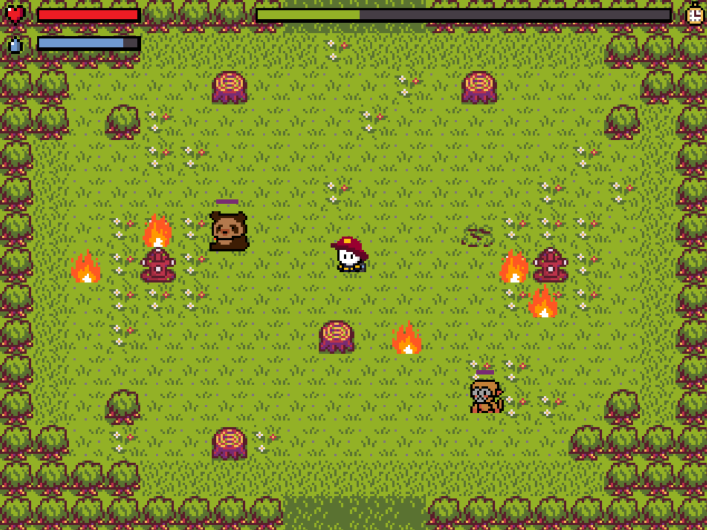

# Fire Guardians

Fire Guardians es un juego arcade inspirado en la lucha por preservar los ecosistemas terrestres y combatir los incendios forestales, un problema crítico para la biodiversidad del Perú y del mundo. El juego está enfocado en la ODS 15 (Vida de ecosistemas terrestres) y busca generar conciencia sobre los incendios que han devastado áreas clave como el Amazonas y los bosques peruanos.

## Objetivo

El objetivo del juego es apagar incendios y salvar animales característicos de las zonas afectadas, como el oso de anteojos, el mono de cola amarilla y el colibrí esmeralda, todo antes de que se acabe el tiempo. Cada nivel presenta desafíos estratégicos que pondrán a prueba tu habilidad para gestionar recursos y tomar decisiones bajo presión.

## Publicación

Prueba el juego en itch.io: [https://guisa17.itch.io/forest-guardians](https://guisa17.itch.io/forest-guardians)

## Controles

- **Movimiento:** WASD o teclas de flecha.
- **Apagar incendios:** Presiona repetidamente Espacio cerca de un fuego.
- **Recargar agua:** Mantén presionada la tecla R junto a una estación de agua.
- **Rescatar animales:** Presiona repetidamente Z y X cerca de los animales.

## Gameplay

---

Este proyecto fue desarrollado con Pygame como una iniciativa para concientizar sobre la preservación de la vida en la Tierra (ODS 15) y destacar la importancia de la biodiversidad y el uso sostenible del territorio.
